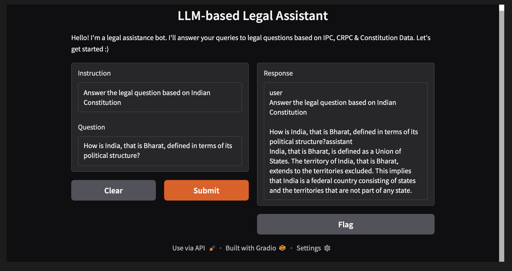
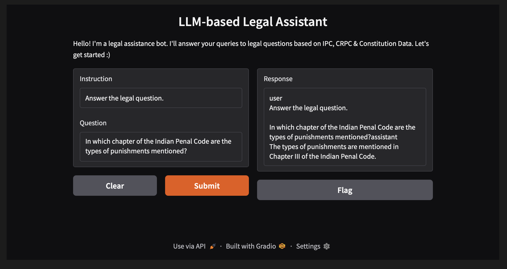

# LEGAL ASSISTANCE BOT (Based on LLM)

**Author: Tanmay Singh**

---

## Project Overview

This repository presents a **legal question-answering assistant** built on top of Meta’s **LLaMA 3.1 8B Instruct** model and fine-tuned using **PEFT (LoRA)**. It supports natural language queries on legal topics, especially about the **Indian Penal Code (IPC)**, **Criminal Procedural Code(CRPC)**, and **Indian Constitution**.

The assistant can be queried via a Python script or a **Gradio web interface** and is designed to run efficiently on limited GPU memory with `torch.float16`.

---

## Key Features

- Fine-tuned Meta LLaMA 3.1 using PEFT (LoRA) for legal reasoning.
- Instruction-following prompt format (using `<|begin_of_text|>` and `user`/`assistant` role tags).
- Interactive Gradio-based web interface for real-time legal Q&A.
- Compatible with consumer GPUs (via `device_map="auto"` and `torch_dtype=torch.float16`).

> **Tech Stack:** Python, PyTorch, Huggingface Transformers, PEFT, Gradio, CUDA

---

## Setup & Usage Instructions

### Prerequisites

- Python 3.10+
- PyTorch with GPU (CUDA 11+)
- Dependencies from `requirements.txt`

### Cloning the Repository

```bash
git clone https://github.com/imtanmay46/Legal-Assistance-LLM.git
cd Legal-Assistance-LLM
```

### 1. Install Dependencies

```bash
pip install -r requirements.txt
```

### 2. Load Base & Fine-tuned Model 
(ONLY if any corrective measures are needed, as the ipynb file contains this itself)

```bash
from transformers import AutoModelForCausalLM, AutoTokenizer
from peft import PeftModel

base_model = AutoModelForCausalLM.from_pretrained(
    "meta-llama/Meta-Llama-3.1-8B-Instruct", 
    device_map="auto", 
    torch_dtype=torch.float16
)

peft_model = PeftModel.from_pretrained(base_model, "path/to/peft_adapter/")
tokenizer = AutoTokenizer.from_pretrained("meta-llama/Meta-Llama-3.1-8B-Instruct", trust_remote_code=True)
```

## Inference Examples

### Sample 1


### Sample 2


## Gradio Web Interface

Visit `http://127.0.0.1:7861` (local URL) or `https://2f4375a3bce0e2241d.gradio.live` (public URL) to chat with the Legal LLaMA Assistant.
